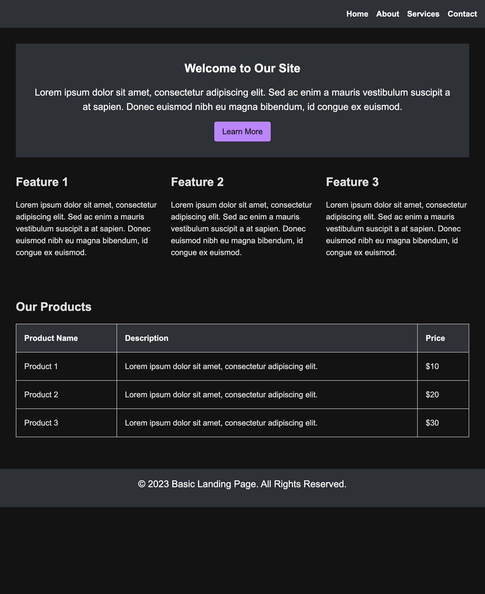

# Landing page challenge - beginner level

The goal of this challenge is to create a basic landing page using the provided HTML and CSS files as a starting point. Your task is to update the CSS file to match the design of the example provided, which includes a grid layout, HTML semantics, a table, columns, and a hero section with a clean, elegant design.

## Helpful Resources and Tips

Here are some helpful resources and tips to complete this challenge:

- Review the example design and CSS code to understand the layout and styling requirements
- Use your browser's developer tools to inspect the elements on the page and experiment with different CSS styles
- Consider using a CSS framework like Bootstrap or Material UI to simplify styling and layout
- Use online resources like W3Schools or MDN Web Docs to learn more about CSS properties and values
- Good luck, and happy coding!

## Design resources

- [Material design dark theme reference](https://m2.material.io/design/color/dark-theme.html)
- [Figma URL](https://www.figma.com/file/JRbecEr7FyIQHqSKUTSAU5/Material-Dark-Theme-Design-Kit?node-id=0%3A660&t=AZjZo70QSxpXh1VW-1)

## CSS resources

- https://www.alura.com.br/apostila-html-css-javascript/13CA-medidas-relativas-em-rem?gclid=CjwKCAjwov6hBhBsEiwAvrvN6K5pt9V88vNFk5TqYP_XHxY_5mxPcZuwFLM6jbwUOzRFbI1WLcqfXRoC1OQQAvD_BwE
- https://css-tricks.com/

## Flexbox training

- [Froggy](https://flexboxfroggy.com/) 🐸

## Contributing

To contribute to this challenge, please follow these steps:

1. Fork the repository
2. Clone the forked repository to your local machine
3. Make changes to the CSS file to match the design of the example provided
4. Test your changes in a web browser to ensure they match the design
5. Commit your changes and push them to your forked repository
6. Create a pull request to merge your changes into the main repository

_Note: Please do not make changes to the HTML file provided, as the challenge is focused on updating the CSS only._

Good luck, and happy coding! 🥂
